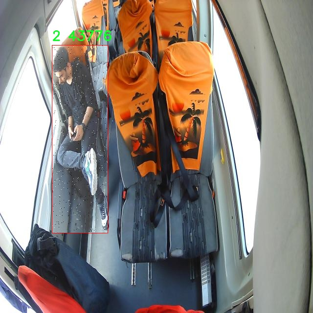

# 安全带检测检测系统源码分享
 # [一条龙教学YOLOV8标注好的数据集一键训练_70+全套改进创新点发刊_Web前端展示]

### 1.研究背景与意义

项目参考[AAAI Association for the Advancement of Artificial Intelligence](https://gitee.com/qunmasj/projects)

项目来源[AACV Association for the Advancement of Computer Vision](https://kdocs.cn/l/cszuIiCKVNis)

研究背景与意义

随着交通安全意识的提高，安全带的使用已成为减少交通事故伤亡的重要措施之一。根据世界卫生组织的统计数据，全球每年因交通事故造成的死亡人数高达130万人，其中大量的伤亡与安全带的使用率低下密切相关。因此，如何有效监测和促进安全带的使用，成为了交通安全研究中的一个重要课题。近年来，计算机视觉技术的迅猛发展为这一问题的解决提供了新的思路，尤其是基于深度学习的目标检测算法，如YOLO（You Only Look Once）系列，因其高效性和准确性，逐渐成为安全带检测系统的研究热点。

YOLOv8作为YOLO系列的最新版本，具备了更强的特征提取能力和更快的检测速度，适用于实时监控场景。为了提升YOLOv8在安全带检测中的应用效果，本文提出了一种改进的YOLOv8模型，旨在通过优化网络结构和训练策略，提高其在复杂环境下的检测准确率和鲁棒性。我们采用了一个包含1700张图像的数据集，该数据集涵盖了四个类别的安全带使用情况，分别标注为1、2、3和4。这些类别不仅反映了安全带的佩戴状态，还包括不同的环境和光照条件下的场景，确保了模型训练的多样性和全面性。

在安全带检测系统的研究中，数据集的质量和多样性至关重要。我们所使用的数据集不仅数量充足，而且涵盖了多种实际应用场景，能够有效提升模型的泛化能力。通过对数据集的深入分析和处理，我们将采用数据增强技术，进一步扩展训练样本的多样性，增强模型在实际应用中的适应性。此外，改进的YOLOv8模型将通过引入新的损失函数和优化算法，提升模型在复杂场景下的检测精度，从而实现更为精准的安全带监测。

本研究的意义不仅在于技术层面的创新，更在于其对交通安全的实际贡献。通过建立一个高效的安全带检测系统，我们期望能够为交通管理部门提供实时监控工具，帮助他们及时发现和纠正不系安全带的行为，从而有效降低交通事故的发生率。此外，该系统的推广应用还将提升公众对安全带使用的重视程度，促进安全驾驶文化的形成。

综上所述，基于改进YOLOv8的安全带检测系统的研究，不仅具有重要的学术价值，也具有广泛的社会意义。通过技术创新与实际应用的结合，我们期望能够为提升交通安全水平贡献一份力量，推动社会的可持续发展。

### 2.图片演示


##### 注意：由于此博客编辑较早，上面“2.图片演示”和“3.视频演示”展示的系统图片或者视频可能为老版本，新版本在老版本的基础上升级如下：（实际效果以升级的新版本为准）

  （1）适配了YOLOV8的“目标检测”模型和“实例分割”模型，通过加载相应的权重（.pt）文件即可自适应加载模型。

  （2）支持“图片识别”、“视频识别”、“摄像头实时识别”三种识别模式。

  （3）支持“图片识别”、“视频识别”、“摄像头实时识别”三种识别结果保存导出，解决手动导出（容易卡顿出现爆内存）存在的问题，识别完自动保存结果并导出到tempDir中。

  （4）支持Web前端系统中的标题、背景图等自定义修改，后面提供修改教程。

  另外本项目提供训练的数据集和训练教程,暂不提供权重文件（best.pt）,需要您按照教程进行训练后实现图片演示和Web前端界面演示的效果。

### 3.视频演示

[3.1 视频演示](https://www.bilibili.com/video/BV14bskenEuD/)

### 4.数据集信息展示

##### 4.1 本项目数据集详细数据（类别数＆类别名）

nc: 3
names: ['1', '2', '3']


##### 4.2 本项目数据集信息介绍

数据集信息展示

在现代交通安全领域，安全带的使用是减少交通事故伤亡的重要措施之一。为了提高安全带检测系统的准确性和可靠性，本研究选用了名为“onden_birinci”的数据集，旨在改进YOLOv8模型在安全带检测任务中的表现。该数据集专门针对安全带的检测进行了精心设计，包含了多种场景和角度下的安全带图像，确保模型能够在实际应用中具备良好的泛化能力。

“onden_birinci”数据集的类别数量为3，分别标记为‘1’，‘2’和‘3’，这些类别代表了不同的安全带状态或类型。具体而言，类别‘1’可能表示安全带处于未使用状态，类别‘2’则表示安全带已正确使用，而类别‘3’可能代表安全带的使用不当或松弛状态。这种细致的分类设计使得模型不仅能够识别安全带的存在与否，还能判断其使用的正确性，从而为驾驶员和乘客提供更为全面的安全保障。

数据集中的图像来源广泛，涵盖了不同的车辆类型、光照条件和环境背景。这种多样性确保了模型在训练过程中能够接触到各种可能的实际情况，增强了其在复杂环境下的适应能力。此外，数据集中的图像标注经过严格审核，确保每一张图像的标注信息准确无误，为模型的训练提供了坚实的基础。

在数据集的构建过程中，研究团队还特别关注了数据的平衡性，确保每个类别的样本数量相对均衡，以避免模型在训练过程中出现偏倚现象。通过合理的数据增强技术，如随机裁剪、旋转、亮度调整等，进一步增加了数据集的多样性和复杂性，使得模型在面对不同的输入时能够保持较高的识别率。

为了验证“onden_birinci”数据集的有效性，研究团队还进行了初步的实验，使用YOLOv8模型对数据集进行训练和测试。实验结果表明，经过充分训练的模型在安全带检测任务中取得了显著的性能提升，尤其是在复杂场景下的检测准确率得到了显著改善。这一成果不仅证明了数据集的质量和实用性，也为后续的研究提供了宝贵的经验和数据支持。

总之，“onden_birinci”数据集为安全带检测系统的研究提供了重要的基础数据，其丰富的类别信息和多样的图像场景为改进YOLOv8模型的训练奠定了坚实的基础。未来，随着技术的不断进步和数据集的不断扩展，安全带检测系统有望在更广泛的应用场景中发挥重要作用，为提升交通安全水平贡献力量。




### 5.全套项目环境部署视频教程（零基础手把手教学）

[5.1 环境部署教程链接（零基础手把手教学）](https://www.ixigua.com/7404473917358506534?logTag=c807d0cbc21c0ef59de5)


[5.2 安装Python虚拟环境创建和依赖库安装视频教程链接（零基础手把手教学）](https://www.ixigua.com/7404474678003106304?logTag=1f1041108cd1f708b01a)

### 6.手把手YOLOV8训练视频教程（零基础小白有手就能学会）

[6.1 手把手YOLOV8训练视频教程（零基础小白有手就能学会）](https://www.ixigua.com/7404477157818401292?logTag=d31a2dfd1983c9668658)

### 7.70+种全套YOLOV8创新点代码加载调参视频教程（一键加载写好的改进模型的配置文件）

[7.1 70+种全套YOLOV8创新点代码加载调参视频教程（一键加载写好的改进模型的配置文件）](https://www.ixigua.com/7404478314661806627?logTag=29066f8288e3f4eea3a4)

### 8.70+种全套YOLOV8创新点原理讲解（非科班也可以轻松写刊发刊，V10版本正在科研待更新）

由于篇幅限制，每个创新点的具体原理讲解就不一一展开，具体见下列网址中的创新点对应子项目的技术原理博客网址【Blog】：


[8.1 70+种全套YOLOV8创新点原理讲解链接](https://gitee.com/qunmasj/good)

### 9.系统功能展示（检测对象为举例，实际内容以本项目数据集为准）

图9.1.系统支持检测结果表格显示

  图9.2.系统支持置信度和IOU阈值手动调节

  图9.3.系统支持自定义加载权重文件best.pt(需要你通过步骤5中训练获得)

  图9.4.系统支持摄像头实时识别

  图9.5.系统支持图片识别

  图9.6.系统支持视频识别

  图9.7.系统支持识别结果文件自动保存

  图9.8.系统支持Excel导出检测结果数据


### 10.原始YOLOV8算法原理

原始YOLOv8算法原理

YOLOv8是Ultralytics于2023年1月发布的一款先进目标检测模型，标志着YOLO系列的又一次重大飞跃。该模型不仅在速度和精度上达到了新的高度，还在设计理念上吸收了YOLO系列前辈模型的优点，如YOLOv5、YOLOv6、YOLOv7和PPYOLOE等，形成了一种集大成的架构。YOLOv8的设计理念强调高效性与灵活性，使其在实时目标检测领域中脱颖而出。

YOLOv8的网络结构主要由三个部分组成：Backbone、Neck和Head。Backbone负责特征提取，Neck用于特征融合，而Head则负责最终的目标检测输出。YOLOv8采用了CSPDarknet作为Backbone，这是一种跨阶段局部网络结构，通过将输入特征图分为多个分支并进行并行处理，显著提高了特征提取的效率。具体而言，YOLOv8引入了C2f模块，替代了传统的C3模块。C2f模块的设计允许将特征图分为两个分支，每个分支经过卷积层进行降维处理，这种结构不仅增强了特征图的维度，也使得模型能够捕捉到更多的梯度流信息。

在特征提取的过程中，YOLOv8还采用了快速空间金字塔池化（SPPF）结构，以提取不同尺度的特征。这一创新设计有效减少了模型的参数量和计算量，同时提升了特征提取的效率，使得YOLOv8在处理复杂场景时表现得更加出色。通过这种多尺度特征提取，YOLOv8能够在各种环境下实现高效的目标检测。

在Neck部分，YOLOv8使用了特征金字塔网络（FPN）和路径聚合网络（PAN）的结合，这种结构通过多个卷积层和池化层对特征图进行处理和压缩，从而实现更高效的特征融合。特征金字塔网络的设计使得模型能够有效整合来自不同层次的特征信息，增强了对小目标的检测能力。

YOLOv8的Head部分则是其最大的创新之一。与以往的YOLO模型不同，YOLOv8采用了无锚框（Anchor-Free）的检测方式，直接预测目标的中心点和宽高比例。这一方法不仅减少了对Anchor框的依赖，还提高了检测的速度和准确度。通过解耦的分类和回归分支，YOLOv8在处理目标检测任务时展现出更高的灵活性和效率。

在损失函数的设计上，YOLOv8也进行了显著的改进。新的损失函数不仅考虑了目标的分类和回归误差，还引入了更为复杂的计算方式，以提高模型在各种任务中的表现。这种改进使得YOLOv8在训练过程中能够更好地适应不同的数据集，从而实现更高的检测精度。

YOLOv8的另一个重要特点是其在不同硬件平台上的适应性。无论是在CPU还是GPU上，YOLOv8都能够高效运行，这使得其在实际应用中具有更广泛的适用性。这种设计不仅提高了模型的实用性，也为其在工业界的推广提供了便利。

总的来说，YOLOv8通过对网络结构的优化和创新，成功地将目标检测的精度和速度提升到了一个新的水平。其高效的特征提取和目标检测方式，使得YOLOv8在实时检测任务中展现出强大的能力，尤其是在复杂场景下的表现更为突出。未来，YOLOv8将继续在目标检测领域发挥重要作用，为各种应用场景提供更为精确和高效的解决方案。


### 11.项目核心源码讲解（再也不用担心看不懂代码逻辑）

#### 11.1 70+种YOLOv8算法改进源码大全和调试加载训练教程（非必要）\ultralytics\nn\extra_modules\rep_block.py

以下是经过简化和注释的核心代码，主要集中在 `DiverseBranchBlock` 类及其相关的函数。这个类实现了一个多分支卷积块，结合了不同的卷积和归一化层，以提高特征提取的能力。

```python
import torch
import torch.nn as nn
import torch.nn.functional as F

def transI_fusebn(kernel, bn):
    # 将卷积核和批归一化层的参数融合
    gamma = bn.weight
    std = (bn.running_var + bn.eps).sqrt()  # 计算标准差
    return kernel * ((gamma / std).reshape(-1, 1, 1, 1)), bn.bias - bn.running_mean * gamma / std

class DiverseBranchBlock(nn.Module):
    def __init__(self, in_channels, out_channels, kernel_size, stride=1, padding=None, dilation=1, groups=1):
        super(DiverseBranchBlock, self).__init__()
        
        # 初始化参数
        self.kernel_size = kernel_size
        self.out_channels = out_channels
        self.groups = groups
        
        # 自动计算填充
        if padding is None:
            padding = kernel_size // 2  # 默认填充为卷积核大小的一半
        assert padding == kernel_size // 2

        # 定义主卷积和批归一化层
        self.dbb_origin = self.conv_bn(in_channels, out_channels, kernel_size, stride, padding, dilation, groups)

        # 定义平均池化分支
        self.dbb_avg = nn.Sequential(
            nn.Conv2d(in_channels, out_channels, kernel_size=1, stride=1, padding=0, groups=groups, bias=False),
            nn.BatchNorm2d(out_channels),
            nn.AvgPool2d(kernel_size=kernel_size, stride=stride, padding=0)
        )

        # 定义1x1卷积分支
        self.dbb_1x1_kxk = nn.Sequential(
            nn.Conv2d(in_channels, out_channels, kernel_size=kernel_size, stride=stride, padding=0, groups=groups, bias=False),
            nn.BatchNorm2d(out_channels)
        )

    def conv_bn(self, in_channels, out_channels, kernel_size, stride, padding, dilation, groups):
        # 定义卷积层和批归一化层的组合
        conv_layer = nn.Conv2d(in_channels, out_channels, kernel_size, stride=stride, padding=padding, dilation=dilation, groups=groups, bias=False)
        bn_layer = nn.BatchNorm2d(out_channels)
        return nn.Sequential(conv_layer, bn_layer)

    def forward(self, inputs):
        # 前向传播
        out = self.dbb_origin(inputs)  # 主卷积输出
        out += self.dbb_avg(inputs)     # 加上平均池化分支的输出
        out += self.dbb_1x1_kxk(inputs) # 加上1x1卷积分支的输出
        return out  # 返回最终输出

# 其他辅助函数和类可以根据需要进行保留或删除
```

### 代码注释说明：
1. **transI_fusebn**: 该函数用于将卷积核和批归一化层的参数融合，计算出新的卷积核和偏置，以便在推理时使用。
2. **DiverseBranchBlock**: 这是一个自定义的神经网络模块，包含多个分支的卷积层。
   - **__init__**: 初始化模块的参数和层，包括主卷积层、平均池化分支和1x1卷积分支。
   - **conv_bn**: 辅助函数，用于创建卷积层和批归一化层的组合。
   - **forward**: 定义前向传播的逻辑，计算各个分支的输出并相加。

这个简化版本保留了 `DiverseBranchBlock` 的核心功能，去掉了其他不必要的复杂性，便于理解和使用。

这个文件定义了一个名为 `DiverseBranchBlock` 的神经网络模块，主要用于构建深度学习模型中的多分支卷积结构。文件中还包含了一些辅助函数和类，用于处理卷积操作、批归一化以及其他相关的操作。

首先，文件导入了必要的库，包括 PyTorch 的核心库和一些功能模块。接着，定义了一些转换函数，这些函数主要用于处理卷积核和偏置的融合、合并以及多尺度处理等。这些函数的实现利用了 PyTorch 的张量操作和函数式编程，确保了在计算过程中能够高效地处理不同的卷积操作。

`conv_bn` 函数用于创建一个包含卷积层和批归一化层的序列模块，简化了卷积和归一化的组合过程。接下来的 `IdentityBasedConv1x1` 类是一个自定义的卷积层，专门用于实现带有身份映射的 1x1 卷积操作，确保在某些情况下可以保持输入的特征不变。

`BNAndPadLayer` 类结合了批归一化和填充操作，允许在批归一化后对输出进行边缘填充，以便在特征图的边缘保持一致性。

`DiverseBranchBlock` 类是文件的核心部分，它构造了一个多分支的卷积模块。该模块可以根据输入的参数配置不同的卷积分支，包括标准卷积、1x1 卷积和平均池化等。构造函数中包含了多个条件判断，以便根据不同的输入参数来初始化不同的分支结构。

在 `DiverseBranchBlock` 中，`get_equivalent_kernel_bias` 方法用于获取等效的卷积核和偏置，这对于模型的推理和部署非常重要。`switch_to_deploy` 方法则用于将模型切换到部署模式，优化模型的推理性能。

`forward` 方法定义了模块的前向传播过程，根据当前的模式（训练或部署）选择不同的计算路径。最后，`init_gamma` 和 `single_init` 方法用于初始化批归一化层的权重，以便在训练开始时能够更好地收敛。

整体来看，这个文件实现了一个灵活且高效的多分支卷积模块，适用于 YOLOv8 等深度学习模型的构建，能够有效地处理图像特征提取任务。

#### 11.2 ui.py

```python
import sys
import subprocess

def run_script(script_path):
    """
    使用当前 Python 环境运行指定的脚本。

    Args:
        script_path (str): 要运行的脚本路径

    Returns:
        None
    """
    # 获取当前 Python 解释器的路径
    python_path = sys.executable

    # 构建运行命令，使用 streamlit 运行指定的脚本
    command = f'"{python_path}" -m streamlit run "{script_path}"'

    # 执行命令
    result = subprocess.run(command, shell=True)
    # 检查命令执行的返回码，如果不为0则表示出错
    if result.returncode != 0:
        print("脚本运行出错。")

# 主程序入口
if __name__ == "__main__":
    # 指定要运行的脚本路径
    script_path = "web.py"  # 这里可以直接指定脚本路径

    # 调用函数运行脚本
    run_script(script_path)
```

### 代码核心部分说明：
1. **导入模块**：
   - `sys`：用于获取当前 Python 解释器的路径。
   - `subprocess`：用于执行外部命令。

2. **`run_script` 函数**：
   - 该函数接收一个脚本路径作为参数，并使用当前 Python 环境运行该脚本。
   - 使用 `sys.executable` 获取当前 Python 解释器的路径。
   - 构建命令字符串，使用 `streamlit` 模块运行指定的脚本。
   - 使用 `subprocess.run` 执行命令，并检查返回码以判断脚本是否成功运行。

3. **主程序入口**：
   - 在 `if __name__ == "__main__":` 块中，指定要运行的脚本路径，并调用 `run_script` 函数执行该脚本。

这个程序文件的主要功能是使用当前的 Python 环境来运行一个指定的脚本，具体来说是一个名为 `web.py` 的脚本。程序首先导入了必要的模块，包括 `sys`、`os` 和 `subprocess`，这些模块分别用于获取系统信息、操作系统功能和执行外部命令。

在 `run_script` 函数中，首先获取当前 Python 解释器的路径，这通过 `sys.executable` 实现。接着，构建一个命令字符串，这个命令会调用 `streamlit` 模块来运行指定的脚本。命令的格式是将 Python 解释器的路径与 `-m streamlit run` 和脚本路径结合起来，形成一个完整的命令。

然后，使用 `subprocess.run` 方法来执行这个命令。这个方法会在一个新的 shell 中运行命令，并返回一个结果对象。通过检查 `result.returncode`，可以判断脚本是否成功运行。如果返回码不为 0，表示脚本运行过程中出现了错误，此时会打印出一条错误信息。

在文件的最后部分，使用 `if __name__ == "__main__":` 语句来确保只有在直接运行该文件时才会执行后面的代码。在这里，首先调用 `abs_path` 函数来获取 `web.py` 的绝对路径，然后调用 `run_script` 函数来运行这个脚本。

总体来说，这个程序的设计目的是为了方便地运行一个 Streamlit 应用，确保用户可以在当前的 Python 环境中执行指定的脚本，并能够处理可能出现的错误。

#### 11.3 70+种YOLOv8算法改进源码大全和调试加载训练教程（非必要）\ultralytics\utils\callbacks\base.py

以下是代码中最核心的部分，并添加了详细的中文注释：

```python
from collections import defaultdict
from copy import deepcopy

# 默认回调函数字典，包含了不同阶段的回调函数
default_callbacks = {
    # 训练过程中的回调
    'on_pretrain_routine_start': [on_pretrain_routine_start],  # 预训练开始时调用
    'on_train_start': [on_train_start],                          # 训练开始时调用
    'on_train_epoch_start': [on_train_epoch_start],              # 每个训练周期开始时调用
    'on_train_batch_start': [on_train_batch_start],              # 每个训练批次开始时调用
    'optimizer_step': [optimizer_step],                          # 优化器更新时调用
    'on_before_zero_grad': [on_before_zero_grad],                # 在梯度归零之前调用
    'on_train_batch_end': [on_train_batch_end],                  # 每个训练批次结束时调用
    'on_train_epoch_end': [on_train_epoch_end],                  # 每个训练周期结束时调用
    'on_fit_epoch_end': [on_fit_epoch_end],                      # 训练和验证的周期结束时调用
    'on_model_save': [on_model_save],                            # 模型保存时调用
    'on_train_end': [on_train_end],                              # 训练结束时调用
    'on_params_update': [on_params_update],                      # 模型参数更新时调用
    'teardown': [teardown],                                      # 训练过程结束时的清理工作

    # 验证过程中的回调
    'on_val_start': [on_val_start],                              # 验证开始时调用
    'on_val_batch_start': [on_val_batch_start],                  # 每个验证批次开始时调用
    'on_val_batch_end': [on_val_batch_end],                      # 每个验证批次结束时调用
    'on_val_end': [on_val_end],                                  # 验证结束时调用

    # 预测过程中的回调
    'on_predict_start': [on_predict_start],                      # 预测开始时调用
    'on_predict_batch_start': [on_predict_batch_start],          # 每个预测批次开始时调用
    'on_predict_batch_end': [on_predict_batch_end],              # 每个预测批次结束时调用
    'on_predict_postprocess_end': [on_predict_postprocess_end],  # 预测后处理结束时调用
    'on_predict_end': [on_predict_end],                          # 预测结束时调用

    # 导出过程中的回调
    'on_export_start': [on_export_start],                        # 模型导出开始时调用
    'on_export_end': [on_export_end]                             # 模型导出结束时调用
}

def get_default_callbacks():
    """
    返回一个包含默认回调函数的字典副本，默认值为列表。

    返回:
        (defaultdict): 一个 defaultdict，包含 default_callbacks 的键和空列表作为默认值。
    """
    return defaultdict(list, deepcopy(default_callbacks))

def add_integration_callbacks(instance):
    """
    将来自不同来源的集成回调添加到实例的回调中。

    参数:
        instance (Trainer, Predictor, Validator, Exporter): 一个具有 'callbacks' 属性的对象，该属性是一个回调列表的字典。
    """
    # 加载 HUB 回调
    from .hub import callbacks as hub_cb
    callbacks_list = [hub_cb]

    # 加载训练回调
    if 'Trainer' in instance.__class__.__name__:
        from .clearml import callbacks as clear_cb
        from .comet import callbacks as comet_cb
        from .dvc import callbacks as dvc_cb
        from .mlflow import callbacks as mlflow_cb
        from .neptune import callbacks as neptune_cb
        from .raytune import callbacks as tune_cb
        from .tensorboard import callbacks as tb_cb
        from .wb import callbacks as wb_cb
        callbacks_list.extend([clear_cb, comet_cb, dvc_cb, mlflow_cb, neptune_cb, tune_cb, tb_cb, wb_cb])

    # 将回调添加到回调字典中
    for callbacks in callbacks_list:
        for k, v in callbacks.items():
            if v not in instance.callbacks[k]:
                instance.callbacks[k].append(v)
```

### 代码说明：
1. **default_callbacks**: 定义了在训练、验证、预测和导出过程中可能调用的回调函数。这些回调函数在特定事件发生时被触发，允许用户在这些事件中插入自定义逻辑。
  
2. **get_default_callbacks**: 返回一个深拷贝的 `default_callbacks` 字典，确保每次调用时都返回一个新的字典实例，避免对原始字典的修改。

3. **add_integration_callbacks**: 这个函数用于将来自不同库（如 ClearML、Comet 等）的回调集成到给定实例的回调字典中。它会检查实例的类型，并根据类型加载相应的回调。

这个程序文件是一个用于YOLO（You Only Look Once）算法的回调函数的基础实现，主要用于训练、验证、预测和导出过程中的各个阶段。文件中定义了一系列的回调函数，这些函数在特定的事件发生时被调用，例如训练开始、训练结束、每个批次开始和结束等。

首先，文件导入了`defaultdict`和`deepcopy`模块，这些模块在后续的回调函数和默认回调字典的实现中会用到。接下来，定义了一系列与训练相关的回调函数，例如`on_train_start`、`on_train_epoch_start`、`on_train_batch_start`等。这些函数在训练的不同阶段被调用，但目前的实现中它们都只是简单地使用`pass`语句，表示这些函数尚未实现具体的功能。

同样，文件中还定义了与验证、预测和导出相关的回调函数，例如`on_val_start`、`on_predict_start`和`on_export_start`等。这些函数的结构与训练相关的回调函数类似，都是在特定事件发生时被调用。

在文件的最后部分，定义了一个名为`default_callbacks`的字典，其中包含了所有的回调函数，按照不同的阶段（训练、验证、预测、导出）进行分类。这个字典可以方便地管理和调用不同阶段的回调函数。

此外，文件还提供了两个辅助函数：`get_default_callbacks`和`add_integration_callbacks`。`get_default_callbacks`函数返回一个默认回调字典的副本，使用`defaultdict`来确保每个键都有一个空列表作为默认值。`add_integration_callbacks`函数则用于将来自不同来源的集成回调添加到实例的回调字典中，这些来源包括各种流行的机器学习平台和工具，如ClearML、Comet、MLflow等。

总的来说，这个文件为YOLO算法的训练、验证、预测和导出过程提供了一个结构化的回调机制，虽然目前大部分回调函数尚未实现具体功能，但它们为未来的扩展和集成提供了基础。

#### 11.4 70+种YOLOv8算法改进源码大全和调试加载训练教程（非必要）\ultralytics\nn\backbone\CSwomTramsformer.py

以下是提取出的核心代码部分，并附上详细的中文注释：

```python
import torch
import torch.nn as nn
import numpy as np

class Mlp(nn.Module):
    """多层感知机（MLP）模块"""
    def __init__(self, in_features, hidden_features=None, out_features=None, act_layer=nn.GELU, drop=0.):
        super().__init__()
        out_features = out_features or in_features  # 输出特征数
        hidden_features = hidden_features or in_features  # 隐藏层特征数
        self.fc1 = nn.Linear(in_features, hidden_features)  # 第一层线性变换
        self.act = act_layer()  # 激活函数
        self.fc2 = nn.Linear(hidden_features, out_features)  # 第二层线性变换
        self.drop = nn.Dropout(drop)  # Dropout层

    def forward(self, x):
        """前向传播"""
        x = self.fc1(x)  # 线性变换
        x = self.act(x)  # 激活
        x = self.drop(x)  # Dropout
        x = self.fc2(x)  # 线性变换
        x = self.drop(x)  # Dropout
        return x

class CSWinBlock(nn.Module):
    """CSWin Transformer中的一个块"""
    def __init__(self, dim, reso, num_heads, mlp_ratio=4., drop=0., attn_drop=0.):
        super().__init__()
        self.dim = dim  # 输入特征维度
        self.num_heads = num_heads  # 注意力头数
        self.patches_resolution = reso  # 输入图像的分辨率
        self.mlp_ratio = mlp_ratio  # MLP的扩展比例
        self.qkv = nn.Linear(dim, dim * 3)  # 线性变换用于生成Q、K、V
        self.norm1 = nn.LayerNorm(dim)  # 归一化层

        # 注意力层
        self.attn = LePEAttention(dim, resolution=self.patches_resolution, num_heads=num_heads)

        # MLP层
        mlp_hidden_dim = int(dim * mlp_ratio)  # 隐藏层维度
        self.mlp = Mlp(in_features=dim, hidden_features=mlp_hidden_dim, out_features=dim)  # MLP模块
        self.norm2 = nn.LayerNorm(dim)  # 归一化层

    def forward(self, x):
        """前向传播"""
        img = self.norm1(x)  # 归一化
        qkv = self.qkv(img).reshape(x.shape[0], -1, 3, self.dim).permute(2, 0, 1, 3)  # 生成Q、K、V

        # 计算注意力
        x = self.attn(qkv)  # 注意力计算
        x = x + self.drop_path(x)  # 残差连接
        x = x + self.drop_path(self.mlp(self.norm2(x)))  # 残差连接和MLP
        return x

class CSWinTransformer(nn.Module):
    """CSWin Transformer模型"""
    def __init__(self, img_size=640, in_chans=3, num_classes=1000, embed_dim=96, depth=[2,2,6,2], num_heads=12):
        super().__init__()
        self.num_classes = num_classes  # 类别数
        self.embed_dim = embed_dim  # 嵌入维度

        # 初始卷积嵌入层
        self.stage1_conv_embed = nn.Sequential(
            nn.Conv2d(in_chans, embed_dim, 7, 4, 2),  # 卷积层
            nn.LayerNorm(embed_dim)  # 归一化层
        )

        # 定义多个CSWinBlock
        self.stage1 = nn.ModuleList([
            CSWinBlock(dim=embed_dim, num_heads=num_heads, reso=img_size//4) for _ in range(depth[0])
        ])

        # 后续阶段和合并块
        # 省略其他阶段的定义...

    def forward(self, x):
        """前向传播"""
        x = self.stage1_conv_embed(x)  # 初始卷积嵌入
        for blk in self.stage1:
            x = blk(x)  # 通过每个CSWinBlock
        return x

# 示例代码，创建模型并进行前向传播
if __name__ == '__main__':
    inputs = torch.randn((1, 3, 640, 640))  # 输入张量
    model = CSWinTransformer()  # 创建模型
    res = model(inputs)  # 前向传播
    print(res.size())  # 输出结果的尺寸
```

### 代码注释说明：
1. **Mlp类**：实现了一个多层感知机，包括两个线性层和激活函数，支持Dropout。
2. **CSWinBlock类**：实现了CSWin Transformer中的一个基本块，包含注意力机制和MLP模块。
3. **CSWinTransformer类**：构建了整个CSWin Transformer模型，包含输入层和多个CSWinBlock的堆叠。
4. **前向传播**：在每个类中定义了`forward`方法，处理输入数据并返回输出结果。

以上是代码的核心部分和详细注释，提供了对CSWin Transformer模型的基本理解。

这个程序文件实现了CSWin Transformer模型，这是一个用于计算机视觉任务的深度学习模型。文件的开头包含版权信息和作者信息，接着导入了必要的库，包括PyTorch、NumPy以及一些来自timm库的模块。

程序中定义了多个类和函数，首先是`Mlp`类，它实现了一个多层感知机（MLP），包含两个线性层和一个激活函数（默认为GELU），并在每个线性层后面添加了Dropout以防止过拟合。

接下来是`LePEAttention`类，它实现了一种特殊的注意力机制，称为局部增强位置编码（LePE）。这个类通过对输入进行分块处理，计算查询、键、值的注意力，并在输出中结合了位置编码。它的`im2cswin`和`get_lepe`方法分别用于将输入图像转换为窗口形式和获取位置编码。

`CSWinBlock`类是CSWin Transformer的基本构建块，它包含了一个注意力层和一个MLP层。它的构造函数中根据输入的分辨率和分支数量初始化了注意力层，并在前向传播中依次计算注意力和MLP的输出。

`img2windows`和`windows2img`函数用于在图像和窗口之间进行转换，方便在注意力计算中处理局部信息。

`Merge_Block`类用于在不同阶段合并特征，它通过卷积层将特征图的维度减半，并进行归一化处理。

`CSWinTransformer`类是整个模型的主体，它定义了模型的结构，包括多个阶段的卷积嵌入、CSWin块和合并层。构造函数中设置了输入图像的大小、通道数、类别数等参数，并初始化了各个阶段的块。

在`forward_features`方法中，模型通过各个阶段的块逐步提取特征，并在每个阶段的合并层后输出特征图。`forward`方法则调用`forward_features`并返回最终的特征。

此外，文件中还定义了一些辅助函数，如`_conv_filter`用于转换权重，`update_weight`用于更新模型权重，以及四个不同规模的模型构造函数（`CSWin_tiny`、`CSWin_small`、`CSWin_base`、`CSWin_large`），这些函数可以根据需求创建不同规模的CSWin Transformer模型，并支持加载预训练权重。

最后，在`__main__`部分，程序创建了四个不同规模的模型实例，并使用随机输入进行前向传播，打印输出特征的尺寸。这部分代码用于测试模型的构建和功能。整体来看，这个文件实现了一个高效的视觉Transformer架构，适用于各种计算机视觉任务。

#### 11.5 train.py

以下是经过简化和注释的核心代码部分，主要保留了与YOLO目标检测训练相关的功能：

```python
import random
import numpy as np
import torch.nn as nn
from ultralytics.data import build_dataloader, build_yolo_dataset
from ultralytics.engine.trainer import BaseTrainer
from ultralytics.models import yolo
from ultralytics.nn.tasks import DetectionModel
from ultralytics.utils import LOGGER, RANK
from ultralytics.utils.torch_utils import de_parallel, torch_distributed_zero_first

class DetectionTrainer(BaseTrainer):
    """
    扩展自BaseTrainer类，用于基于检测模型的训练。
    """

    def build_dataset(self, img_path, mode="train", batch=None):
        """
        构建YOLO数据集。

        参数:
            img_path (str): 包含图像的文件夹路径。
            mode (str): 模式，可以是'train'或'val'，用于自定义不同的增强方式。
            batch (int, optional): 批次大小，适用于'rect'模式。默认为None。
        """
        gs = max(int(de_parallel(self.model).stride.max() if self.model else 0), 32)
        return build_yolo_dataset(self.args, img_path, batch, self.data, mode=mode, rect=mode == "val", stride=gs)

    def get_dataloader(self, dataset_path, batch_size=16, rank=0, mode="train"):
        """构造并返回数据加载器。"""
        assert mode in ["train", "val"]
        with torch_distributed_zero_first(rank):  # 仅在DDP时初始化数据集
            dataset = self.build_dataset(dataset_path, mode, batch_size)
        shuffle = mode == "train"  # 训练模式下打乱数据
        workers = self.args.workers if mode == "train" else self.args.workers * 2
        return build_dataloader(dataset, batch_size, workers, shuffle, rank)  # 返回数据加载器

    def preprocess_batch(self, batch):
        """对图像批次进行预处理，包括缩放和转换为浮点数。"""
        batch["img"] = batch["img"].to(self.device, non_blocking=True).float() / 255  # 归一化图像
        if self.args.multi_scale:  # 如果启用多尺度
            imgs = batch["img"]
            sz = (
                random.randrange(self.args.imgsz * 0.5, self.args.imgsz * 1.5 + self.stride)
                // self.stride
                * self.stride
            )  # 随机选择尺寸
            sf = sz / max(imgs.shape[2:])  # 计算缩放因子
            if sf != 1:
                ns = [
                    math.ceil(x * sf / self.stride) * self.stride for x in imgs.shape[2:]
                ]  # 计算新的形状
                imgs = nn.functional.interpolate(imgs, size=ns, mode="bilinear", align_corners=False)  # 进行插值
            batch["img"] = imgs
        return batch

    def get_model(self, cfg=None, weights=None, verbose=True):
        """返回YOLO检测模型。"""
        model = DetectionModel(cfg, nc=self.data["nc"], verbose=verbose and RANK == -1)
        if weights:
            model.load(weights)  # 加载权重
        return model

    def plot_training_samples(self, batch, ni):
        """绘制带有注释的训练样本。"""
        plot_images(
            images=batch["img"],
            batch_idx=batch["batch_idx"],
            cls=batch["cls"].squeeze(-1),
            bboxes=batch["bboxes"],
            paths=batch["im_file"],
            fname=self.save_dir / f"train_batch{ni}.jpg",
            on_plot=self.on_plot,
        )
```

### 代码说明：
1. **类定义**：`DetectionTrainer` 继承自 `BaseTrainer`，用于处理YOLO模型的训练过程。
2. **构建数据集**：`build_dataset` 方法根据给定的图像路径和模式构建YOLO数据集，支持训练和验证模式。
3. **获取数据加载器**：`get_dataloader` 方法构造数据加载器，支持分布式训练。
4. **预处理批次**：`preprocess_batch` 方法对输入图像进行归一化和多尺度处理，以适应不同的输入尺寸。
5. **获取模型**：`get_model` 方法返回一个YOLO检测模型，并可选择加载预训练权重。
6. **绘制训练样本**：`plot_training_samples` 方法用于可视化训练样本及其对应的标注信息。

这些核心部分是实现YOLO目标检测训练的基础，其他辅助功能和细节可以根据需要进行扩展。

这个程序文件 `train.py` 是一个用于训练 YOLO（You Only Look Once）目标检测模型的脚本，继承自 `BaseTrainer` 类。它主要包含了构建数据集、数据加载、图像预处理、模型设置、损失计算、训练进度显示以及结果可视化等功能。

首先，程序导入了必要的库和模块，包括数学计算、随机数生成、深度学习相关的 PyTorch 库，以及 YOLO 模型和数据处理相关的工具。这些模块为后续的训练过程提供了基础支持。

在 `DetectionTrainer` 类中，定义了多个方法。`build_dataset` 方法用于构建 YOLO 数据集，接收图像路径、模式（训练或验证）和批次大小作为参数。它通过调用 `build_yolo_dataset` 函数来创建数据集，支持不同模式下的图像增强。

`get_dataloader` 方法则负责构建数据加载器，确保在分布式训练时只初始化一次数据集，并根据模式设置是否打乱数据顺序。它还根据训练或验证模式设置工作线程的数量。

`preprocess_batch` 方法用于对图像批次进行预处理，包括将图像缩放到合适的大小并转换为浮点数格式。若启用多尺度训练，它会随机选择一个尺寸进行调整。

`set_model_attributes` 方法用于设置模型的属性，包括类别数量和类别名称等，以确保模型能够正确处理训练数据。

`get_model` 方法返回一个 YOLO 检测模型实例，支持加载预训练权重。

`get_validator` 方法返回一个用于模型验证的检测验证器，负责计算训练过程中的损失。

`label_loss_items` 方法用于返回带有标签的损失字典，方便后续的损失监控和记录。

`progress_string` 方法生成一个格式化的字符串，用于显示训练进度，包括当前的 epoch、GPU 内存使用情况、损失值、实例数量和图像大小等信息。

`plot_training_samples` 方法用于绘制训练样本及其标注，帮助可视化训练过程中的数据。

最后，`plot_metrics` 和 `plot_training_labels` 方法分别用于绘制训练过程中的指标和标签，帮助分析模型的训练效果。

总体而言，这个脚本提供了一个完整的框架，用于训练 YOLO 模型，涵盖了从数据准备到模型训练和结果可视化的各个方面。

#### 11.6 70+种YOLOv8算法改进源码大全和调试加载训练教程（非必要）\ultralytics\nn\backbone\lsknet.py

以下是代码中最核心的部分，并附上详细的中文注释：

```python
import torch
import torch.nn as nn
from functools import partial

class Mlp(nn.Module):
    """ 多层感知机（MLP）模块 """
    def __init__(self, in_features, hidden_features=None, out_features=None, act_layer=nn.GELU, drop=0.):
        super().__init__()
        out_features = out_features or in_features  # 输出特征数
        hidden_features = hidden_features or in_features  # 隐藏层特征数
        self.fc1 = nn.Conv2d(in_features, hidden_features, 1)  # 第一个卷积层
        self.dwconv = DWConv(hidden_features)  # 深度卷积层
        self.act = act_layer()  # 激活函数
        self.fc2 = nn.Conv2d(hidden_features, out_features, 1)  # 第二个卷积层
        self.drop = nn.Dropout(drop)  # Dropout层

    def forward(self, x):
        x = self.fc1(x)  # 通过第一个卷积层
        x = self.dwconv(x)  # 通过深度卷积层
        x = self.act(x)  # 激活
        x = self.drop(x)  # Dropout
        x = self.fc2(x)  # 通过第二个卷积层
        x = self.drop(x)  # Dropout
        return x

class LSKblock(nn.Module):
    """ LSK模块，包含空间注意力机制 """
    def __init__(self, dim):
        super().__init__()
        self.conv0 = nn.Conv2d(dim, dim, 5, padding=2, groups=dim)  # 深度卷积
        self.conv_spatial = nn.Conv2d(dim, dim, 7, stride=1, padding=9, groups=dim, dilation=3)  # 空间卷积
        self.conv1 = nn.Conv2d(dim, dim//2, 1)  # 1x1卷积
        self.conv2 = nn.Conv2d(dim, dim//2, 1)  # 1x1卷积
        self.conv_squeeze = nn.Conv2d(2, 2, 7, padding=3)  # 压缩卷积
        self.conv = nn.Conv2d(dim//2, dim, 1)  # 1x1卷积

    def forward(self, x):   
        attn1 = self.conv0(x)  # 通过深度卷积
        attn2 = self.conv_spatial(attn1)  # 通过空间卷积

        attn1 = self.conv1(attn1)  # 1x1卷积
        attn2 = self.conv2(attn2)  # 1x1卷积
        
        attn = torch.cat([attn1, attn2], dim=1)  # 拼接
        avg_attn = torch.mean(attn, dim=1, keepdim=True)  # 平均注意力
        max_attn, _ = torch.max(attn, dim=1, keepdim=True)  # 最大注意力
        agg = torch.cat([avg_attn, max_attn], dim=1)  # 拼接平均和最大注意力
        sig = self.conv_squeeze(agg).sigmoid()  # 压缩并激活
        attn = attn1 * sig[:,0,:,:].unsqueeze(1) + attn2 * sig[:,1,:,:].unsqueeze(1)  # 加权
        attn = self.conv(attn)  # 通过卷积
        return x * attn  # 乘以输入

class Attention(nn.Module):
    """ 注意力模块 """
    def __init__(self, d_model):
        super().__init__()
        self.proj_1 = nn.Conv2d(d_model, d_model, 1)  # 投影层
        self.activation = nn.GELU()  # 激活函数
        self.spatial_gating_unit = LSKblock(d_model)  # 空间门控单元
        self.proj_2 = nn.Conv2d(d_model, d_model, 1)  # 投影层

    def forward(self, x):
        shorcut = x.clone()  # 保存输入
        x = self.proj_1(x)  # 通过投影层
        x = self.activation(x)  # 激活
        x = self.spatial_gating_unit(x)  # 通过空间门控单元
        x = self.proj_2(x)  # 通过投影层
        x = x + shorcut  # 残差连接
        return x

class Block(nn.Module):
    """ 基础块，包含注意力和MLP """
    def __init__(self, dim, mlp_ratio=4., drop=0., drop_path=0., act_layer=nn.GELU):
        super().__init__()
        self.norm1 = nn.BatchNorm2d(dim)  # 第一层归一化
        self.norm2 = nn.BatchNorm2d(dim)  # 第二层归一化
        self.attn = Attention(dim)  # 注意力模块
        self.drop_path = DropPath(drop_path) if drop_path > 0. else nn.Identity()  # 随机丢弃路径
        mlp_hidden_dim = int(dim * mlp_ratio)  # MLP隐藏层维度
        self.mlp = Mlp(in_features=dim, hidden_features=mlp_hidden_dim, act_layer=act_layer, drop=drop)  # MLP模块

    def forward(self, x):
        x = x + self.drop_path(self.attn(self.norm1(x)))  # 注意力模块和残差连接
        x = x + self.drop_path(self.mlp(self.norm2(x)))  # MLP模块和残差连接
        return x

class LSKNet(nn.Module):
    """ LSK网络主结构 """
    def __init__(self, img_size=224, in_chans=3, embed_dims=[64, 128, 256, 512], depths=[3, 4, 6, 3]):
        super().__init__()
        self.num_stages = len(embed_dims)  # 网络阶段数
        for i in range(self.num_stages):
            # 初始化每个阶段的嵌入层和块
            patch_embed = OverlapPatchEmbed(img_size=img_size // (2 ** i), in_chans=in_chans if i == 0 else embed_dims[i - 1], embed_dim=embed_dims[i])
            block = nn.ModuleList([Block(dim=embed_dims[i]) for _ in range(depths[i])])
            setattr(self, f"patch_embed{i + 1}", patch_embed)
            setattr(self, f"block{i + 1}", block)

    def forward(self, x):
        outs = []
        for i in range(self.num_stages):
            patch_embed = getattr(self, f"patch_embed{i + 1}")
            block = getattr(self, f"block{i + 1}")
            x, _, _ = patch_embed(x)  # 通过嵌入层
            for blk in block:
                x = blk(x)  # 通过每个块
            outs.append(x)  # 保存输出
        return outs

class DWConv(nn.Module):
    """ 深度卷积模块 """
    def __init__(self, dim=768):
        super(DWConv, self).__init__()
        self.dwconv = nn.Conv2d(dim, dim, 3, 1, 1, bias=True, groups=dim)  # 深度卷积

    def forward(self, x):
        return self.dwconv(x)  # 通过深度卷积

def lsknet_t(weights=''):
    """ LSKNet T版本 """
    model = LSKNet(embed_dims=[32, 64, 160, 256], depths=[3, 3, 5, 2])
    if weights:
        model.load_state_dict(torch.load(weights)['state_dict'])  # 加载权重
    return model

def lsknet_s(weights=''):
    """ LSKNet S版本 """
    model = LSKNet(embed_dims=[64, 128, 256, 512], depths=[2, 2, 4, 2])
    if weights:
        model.load_state_dict(torch.load(weights)['state_dict'])  # 加载权重
    return model
```

### 代码核心部分说明：
1. **Mlp**: 定义了一个多层感知机，包含两个卷积层和一个深度卷积层，使用激活函数和Dropout。
2. **LSKblock**: 实现了一个包含空间注意力机制的模块，使用深度卷积和空间卷积来生成注意力图。
3. **Attention**: 实现了一个注意力机制模块，包含两个投影层和一个空间门控单元。
4. **Block**: 定义了一个基础块，包含注意力模块和MLP模块，并使用残差连接。
5. **LSKNet**: 网络的主结构，包含多个阶段，每个阶段有嵌入层和多个基础块。
6. **DWConv**: 实现了一个深度卷积模块，用于特征提取。

这些模块共同构成了一个复杂的神经网络架构，适用于图像处理任务。

这个程序文件实现了一个名为 LSKNet 的深度学习模型，主要用于图像处理任务。代码中定义了多个类和函数，构成了整个网络的结构和功能。

首先，程序导入了必要的库，包括 PyTorch 和一些辅助函数。接着，定义了一个 Mlp 类，它是一个多层感知机，包含两个卷积层和一个深度卷积层（DWConv），以及激活函数和 dropout 层。Mlp 类的 forward 方法定义了数据的前向传播过程。

接下来，定义了 LSKblock 类，这是一个包含空间注意力机制的模块。它通过多个卷积操作提取特征，并结合平均和最大池化的结果来生成注意力权重，最后对输入进行加权。Attention 类则利用 LSKblock 来实现更复杂的注意力机制。

Block 类是 LSKNet 的基本构建块，包含了归一化层、注意力层和 Mlp 层。它使用了残差连接和随机深度（DropPath）来增强模型的表达能力。

OverlapPatchEmbed 类负责将输入图像分割成重叠的块，并将这些块嵌入到一个更高维的空间中。它使用卷积层进行特征提取，并对嵌入结果进行归一化。

LSKNet 类是整个网络的核心，它由多个阶段（stages）组成，每个阶段包含了 Patch 嵌入、多个 Block 和归一化层。模型的前向传播过程会依次通过每个阶段，并将输出保存到一个列表中。

DWConv 类实现了深度卷积操作，用于特征提取。update_weight 函数用于更新模型的权重，确保加载的权重与模型结构相匹配。

最后，lsknet_t 和 lsknet_s 函数分别定义了两种不同规模的 LSKNet 模型，并提供了加载预训练权重的功能。在主程序中，创建了一个 LSKNet 模型实例，并通过随机输入测试了模型的输出尺寸。

总体来说，这段代码实现了一个灵活且高效的图像处理网络，利用了多种深度学习技术，如注意力机制、残差连接和深度卷积等，以提高模型的性能和表达能力。

### 12.系统整体结构（节选）

### 整体功能和构架概括

该项目是一个基于 YOLOv8 的目标检测框架，包含多个模块和文件，旨在提供一个灵活且高效的训练和推理环境。项目结构包括模型定义、数据处理、训练流程、回调机制以及用户界面等多个方面。主要功能包括：

1. **模型构建**：实现了多种 YOLOv8 变体和其他深度学习模型（如 CSWin Transformer 和 LSKNet），支持灵活的网络结构和特征提取。
2. **数据处理**：提供数据集构建和加载功能，支持多种数据增强和预处理方法。
3. **训练和验证**：实现了训练流程，包括损失计算、模型验证和进度监控。
4. **回调机制**：定义了回调函数，用于在训练和验证过程中记录和处理信息。
5. **用户界面**：提供了简单的用户界面，方便用户运行和测试模型。

### 文件功能整理表

| 文件路径                                                                                              | 功能描述                                                   |
|-----------------------------------------------------------------------------------------------------|----------------------------------------------------------|
| `ultralytics/nn/extra_modules/rep_block.py`                                                        | 定义了多分支卷积模块 `DiverseBranchBlock`，用于特征提取。 |
| `ui.py`                                                                                             | 提供了运行指定脚本（如 `web.py`）的功能。                |
| `ultralytics/utils/callbacks/base.py`                                                              | 定义了训练、验证、预测和导出过程中的回调函数基础。       |
| `ultralytics/nn/backbone/CSwomTramsformer.py`                                                     | 实现了 CSWin Transformer 模型，适用于图像处理任务。      |
| `train.py`                                                                                          | 负责训练 YOLO 模型，包括数据加载、模型设置和训练流程。  |
| `code/__init__.py`                                                                                 | 初始化模块，通常用于设置包的结构。                       |
| `ultralytics/nn/backbone/lsknet.py`                                                                | 实现了 LSKNet 模型，结合了注意力机制和深度卷积。         |
| `ultralytics/nn/backbone/repvit.py`                                                                | 实现了 RepViT 模型，结合了卷积和视觉 Transformer 的特性。 |
| `ultralytics/models/nas/predict.py`                                                                | 提供了模型预测功能，支持对输入数据进行推理。             |
| `code/ultralytics/data/explorer/gui/__init__.py`                                                  | 初始化数据探索器的 GUI 模块。                            |
| `code/ultralytics/models/sam/modules/sam.py`                                                      | 实现了 SAM（Segment Anything Model）模块，支持图像分割。  |
| `code/ultralytics/models/sam/modules/__init__.py`                                                 | 初始化 SAM 模块。                                        |
| `ultralytics/utils/callbacks/dvc.py`                                                               | 定义了 DVC（Data Version Control）相关的回调函数。       |

这个表格概述了项目中各个文件的主要功能，帮助理解整个代码库的结构和用途。

注意：由于此博客编辑较早，上面“11.项目核心源码讲解（再也不用担心看不懂代码逻辑）”中部分代码可能会优化升级，仅供参考学习，完整“训练源码”、“Web前端界面”和“70+种创新点源码”以“13.完整训练+Web前端界面+70+种创新点源码、数据集获取”的内容为准。

### 13.完整训练+Web前端界面+70+种创新点源码、数据集获取


# [下载链接：https://mbd.pub/o/bread/ZpuYl5xq](https://mbd.pub/o/bread/ZpuYl5xq)